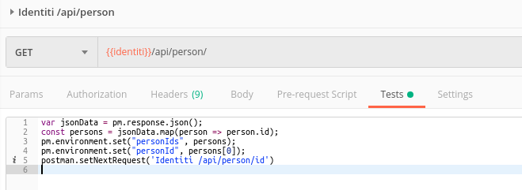
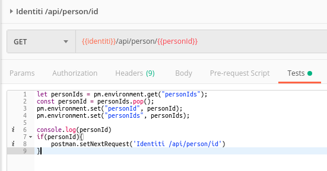
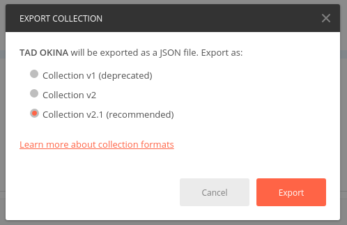
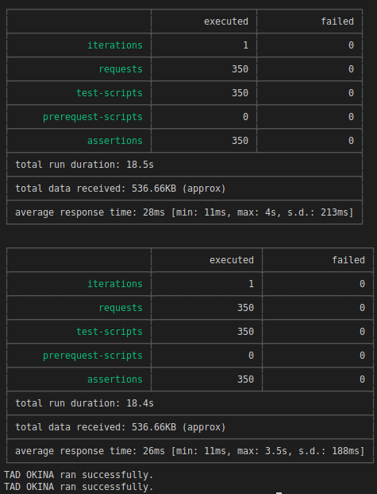

# Running multiple Postman Collection in parallel

A known limitation of the Postman Collection Runner is that it can only execute collection in a consecutive way. 

This project is a simple implementation of the solution explained in this [StackOverflow conversation](https://stackoverflow.com/a/41181892/2042761).

## Recent changes

Added a new postman collection that call for a public api: [https://openlibrary.org/dev/docs/api/lists](https://openlibrary.org/dev/docs/api/lists) so the project can be run right away after checkout. 

## Create your Postman Collection and corresponding tests

Here I needed to attack first `/api/persons` to get the list of persons ids. 

And then `/api/persons/:id` for each person in the list. 

To do that I used the `postman.setNextRequest()` tricks that specify the next request that will be executed in the collection run. And in each run I get the last personId and pop() it from the array in environment variables. 

## Export your collection and the environment variables

And save the files in a `postman/` directory. 

## Create the new npm project

Simply run `npm init -y` and install the 3 dependencies: `npm i async newman path`

## The script !

It's kind of self explanatory, update the path for your postman collection and environment, specify the number of concurrent run you want to launch with the constant `PARALLEL_RUN_COUNT` and execute the script with `npm start` 

